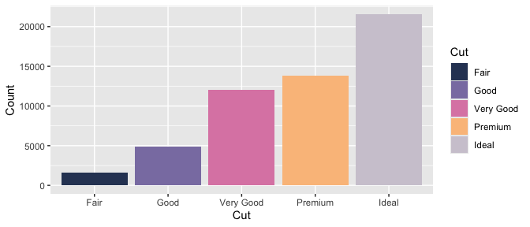
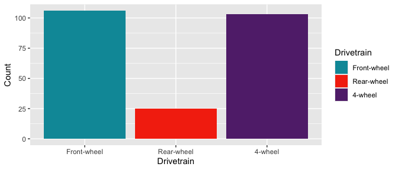
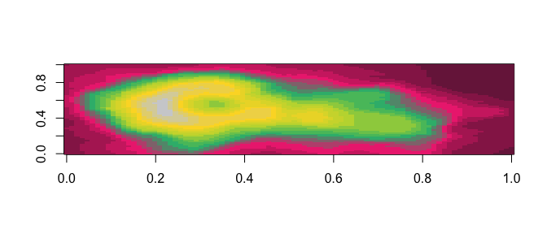

<!-- README.md is generated from README.Rmd. Please edit that file -->

    ## Loading required package: markdown

    ## 
    ## Output created: README.html

    ## [1] "README.html"

# Drygate Brewery Color Palettes

<!--  -->

This is an R color palette of one of my favorite breweries: Drygate
Brewing Co. from Glasgow, Scotland: <https://www.drygate.com>. Excellent
in taste *and* labels.

Credits go to Karthik Ram and his [Wes Anderson color palette
package](https://github.com/karthik/wesanderson) for inspiration and
code.

## Installation

``` r
install.packages("")
```

**The development version**

``` r
devtools::install_github("MAClaassen/drygatebrewer")
```

## Usage

``` r
library("drygatebrewer")
# See all palettes
names(drygate_palettes)
#>  [1] "SevenPeaks"         "GladEyeIPA"         "KelvinPilsner"     
#>  [4] "BearfaceLager"      "DiscoForkliftTruck" "TakeMeTotheRiver"  
#>  [7] "CrossingtheRubicon" "Drygate"            "CloudCity"         
#> [10] "Shred"              "Voller"
```

## Palettes

### Basic

#### Drygate Bewery

``` r
drygate_palette("Drygate")
```

<!-- -->

#### Seven Peaks

``` r
drygate_palette("SevenPeaks")
```

<!-- -->

#### GladEye IPA

``` r
drygate_palette("GladEyeIPA")
```

<!-- -->

#### Kelvin Pilsner

``` r
drygate_palette("KelvinPilsner")
```

<!-- -->

#### Bearface Lager

``` r
drygate_palette("BearfaceLager")
```

<!-- -->

### Fun

#### Disco Forklift Truck

``` r
drygate_palette("DiscoForkliftTruck")
```

<!-- -->

#### Take Me To the River

``` r
drygate_palette("TakeMeTotheRiver")
```

<!-- -->

#### Crossing the Rubicon

``` r
drygate_palette("CrossingtheRubicon")
```

<!-- -->

``` r
drygate_palette("CloudCity")
```

<!-- -->

``` r
drygate_palette("Shred")
```

<!-- -->

``` r
drygate_palette("Voller")
```

<!-- -->

### Example uses

``` r
library("ggplot2")
ggplot(diamonds, aes(cut, fill = cut)) +
  geom_bar() +
  scale_fill_manual(values = drygate_palette("CloudCity")) +
  labs(x = "Cut", y = "Count", fill = "Cut")
```

<!-- -->

``` r

# pick specific colors
mpg$drivetrain <- factor(mpg$drv, levels = c("f", "r", "4"),
                          labels = c("Front-wheel", "Rear-wheel", "4-wheel"))
pal <- drygate_palette("Drygate")[c(1, 4, 6)]
ggplot(mpg, aes(drivetrain, fill = drivetrain)) +
  geom_bar() +
  scale_fill_manual(values = pal) +
  labs(x = "Drivetrain", y = "Count", fill = "Drivetrain")
```

<!-- -->

``` r
pal <- drygate_palette("TakeMeTotheRiver", 21, type = "continuous")
image(volcano, col = pal)
```

<!-- -->
